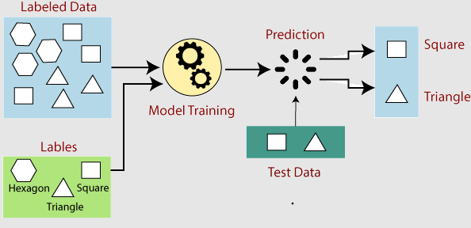

# What is Machine Learning?

Machine learning is a subfield of artificial intelligence that involves developing algorithms and statistical models to enable computers to learn and make decisions without being explicitly programmed. It is based on the idea that systems can learn from data, identify patterns, and make decisions based on those patterns without being explicitly told how to do so.

 
<figure>
  
  <figcaption style="color:grey; font-style: italic;">Credit: Javatpoint, "How does Machine Learning Work?"</figcaption>
</figure>
 

## How Machine Learning works

The process involves several key steps:

1. Data Collection: Gather relevant data representing the problem at hand from various sources such as databases, sensors, or web scraping.
2. Data Preprocessing: Clean the data, remove / flag offensive data, handle missing values, normalize the data to a consistent format.
3. Feature Extraction and Selection: Identify the most informative and relevant features contributing to the learning task.
4. Model Training: The model learns from the pre-processed data by adjusting its internal parameters based on the patterns and relationships it discovers.
5. Model Evaluation: The model is evaluated to assess its performance and generalization ability after training it.
6. Prediction or Decision Making: Once the model is trained and evaluated, it can predict or decide on new, unseen data. The model takes input features and applies the learned patterns to generate the desired output or prediction.
7. Model Refinement and Iteration: If the model's performance is unsatisfactory we can make adjustments by retraining the model with additional data, changing the algorithm, or tuning the model's parameters.

## Limitations

Let's have a look at a general definition of "model" from the Cambridge Dictionary of English:

> A simple representation of a system or process that can be used in calculations or predictions of what might happen.

We understand that a model isn't reality, but rather a simplified representation of a section of it, a conceptual and mathematical construct. Hence we can start to raise a few key points of attention on the topic:

- can we project into the future what we have perceived in the past?
- the data on which the model has been trained
- the design of the training algorithm and of the model
- the ability we have to investigate the calculations
- the trust we put in the delivered predictions
- the scale to which we apply the suggested solutions
- the carbon footprint of this technology, especially with cloud services

## References

- [Javatpoint, "How does Machine Learning Work?"](https://www.javatpoint.com/how-does-machine-learning-work)
- [Cambridge Dictionary of English, definition of "model"](https://dictionary.cambridge.org/dictionary/english/model)
