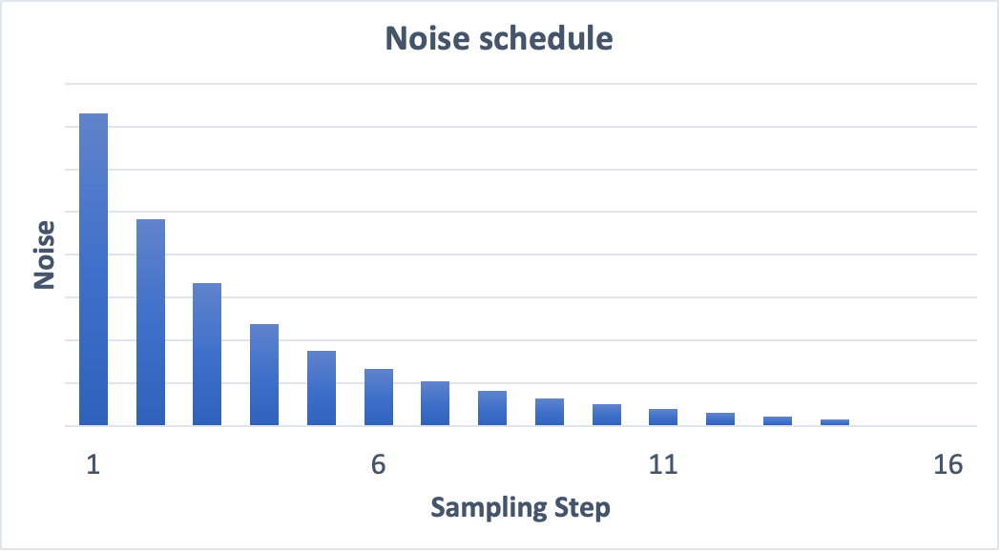

# Samplers

## What is Sampling?

To produce an image, Stable Diffusion first generates a completely random image in the latent space. The noise predictor then estimates the noise of the image. The predicted noise is subtracted from the image. This process is repeated a dozen times. In the end, you get a clean image.

This denoising process is called sampling because Stable Diffusion generates a new sample image in each step. The method used in sampling is called the sampler or sampling method.

 
<figure>
  
  <figcaption style="color:grey; font-style: italic;">Credit: Andrew Wong, 2023, "How does Stable Diffusion work?"</figcaption>
  <figcaption>The sampler is responsible for carrying out the denoising steps.</figcaption>
</figure>
 

## Noise schedule

The noise schedule controls the noise level at each sampling step. The noise is highest at the first step and gradually reduces to zero at the last step. At each step, the sampler’s job is to produce an image with a noise level matching the noise schedule.

Increasing the number of sampling steps makes a smaller noise reduction between each step. This helps to reduce the truncation error of the sampling.

 
<figure>
  
  <figcaption style="color:grey; font-style: italic;">Credit: Andrew Wong, 2023, "How does Stable Diffusion work?"</figcaption>
  <figcaption>Noise schedule for 15 sampling steps.</figcaption>
</figure>
 

## Which sampler to choose?

### Ancestral samplers

Some sampler’s names are followrd by a single letter “a”

- Euler a
- DPM2 a
- DPM++ 2S a
- DPM++ 2S a Karras

They are ancestral samplers. An ancestral sampler adds noise to the image at each sampling step. They are stochastic samplers because the sampling outcome has some randomness to it. The drawback of using an ancestral sampler is that the image would not converge. For reproducibility, it is desirable to have the image converge.

Be aware that many others are also stochastic samplers, even though their names do not have an “a” in them.

### Recommendations

1. If you want to use something fast, converging, new, and with decent quality, excellent choices are
  - DPM++ 2M Karras with 20 – 30 steps
  - UniPC with 20-30 steps.
2. If you want good quality images and don’t care about convergence, good choices are
  - DPM++ SDE Karras with 10-15 steps (Note: This is a slower sampler)
  - DDIM with 10-15 steps.
3. Euler and Heun are fine choices if you prefer something simple. Reduce the number of steps for Heun to save time.
4. Avoid using any ancestral samplers if you prefer stable, reproducible images.

## References

- [Andrew Wong, 2023, "Know these Important Parameters for stunning AI images", _Stable Diffusion Art_](https://stable-diffusion-art.com/know-these-important-parameters-for-stunning-ai-images/#Sampling_steps)
- [Andrew Wong, 2023, "Know these Important Parameters for stunning AI images", _Stable Diffusion Art_](https://stable-diffusion-art.com/know-these-important-parameters-for-stunning-ai-images/#Sampling_methods)
- [Andrew Wong, 2023, "Samplers", _Stable Diffusion Art_](https://stable-diffusion-art.com/samplers/)
