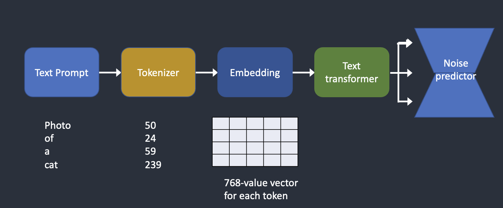

# Conditioning

The purpose of conditioning is to steer the noise predictor so that the predicted noise will give us what we want after subtracting from the image.

## Text conditioning (text-to-image)

Below is an overview of how a text prompt is processed and fed into the noise predictor. Tokenizer first converts each word in the prompt to a number called a token. Each token is then converted to a vector called embedding. The embeddings are then processed by the text transformer and are ready to be consumed by the noise predictor.

 
<figure>
  
  <figcaption style="color:grey; font-style: italic;">Credit: Andrew Wong, 2023, "How does Stable Diffusion work?"</figcaption>
</figure>
 

## Tokenizer

The text prompt is first tokenized by a CLIP tokenizer. CLIP is a deep learning model developed by Open AI to produce text descriptions of any images. Stable Diffusion v1 uses CLIP’s tokenizer.

Tokenization is the computer’s way of understanding words. We humans can read words, but computers can only read numbers. That’s why words in a text prompt are first converted to numbers.

## Embedding

Embedding is a 768-value vector. Each token has its own unique embedding vector. Embedding is fixed by the CLIP model, which is learned during training.

Why do we need embedding? It’s because some words are closely related to each other. We want to take advantage of this information. For example, the embeddings of man, gentleman, and guy are nearly identical because they can be used interchangeably. Monet, Manet, and Degas all painted in impressionist styles but in different ways. The names have close but not identical embeddings.

Embedding can also be used to trigger a style with a keyword. We will discuss this in the section [4 - Model Training 💾](../5-ml_society/README.md)

## Text transformer

The embedding needs to be further processed by the text transformer before feeding into the noise predictor. The output of the text transformer is used multiple times by the noise predictor. That’s where the prompt meets the image (cross-attention).

Let’s use the prompt “A man with blue eyes” as an example. Stable Diffusion pairs the two words “blue” and “eyes” together so that it generates a man with blue eyes but not a man with a blue shirt. It then uses this information to steer the reverse diffuse towards images containing blue eyes.

## Other conditionings

The text prompt is not the only way a Stable Diffusion model can be conditioned. ControlNet for instance conditions the noise predictor with detected outlines, human poses, etc, and achieves excellent controls over image generations. We will discuss this in the section [3 – Image Compositing 📐](../3-refine_images/README.md)

## References

- [Andrew Wong, 2023, "How does Stable Diffusion work?", _Stable Diffusion Art_](https://stable-diffusion-art.com/how-stable-diffusion-work/)
