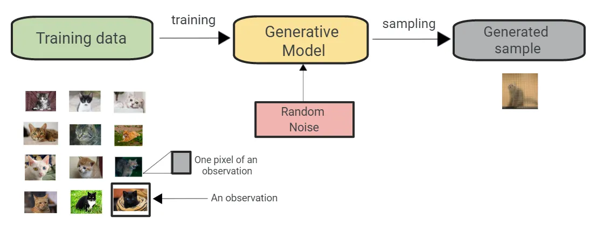

# Diffusion Models

During this course we will be focusing on Stable Diffusion (SD) to create generative art. Stable Diffusion belongs to a class of deep learning models called diffusion models. They are generative models, meaning they are designed to generate new data similar to what they have seen in training. In the case of Stable Diffusion, the data are images.

 
<figure>
  
  <figcaption style="color:grey; font-style: italic;">Credit: Himanshu Wagh, 2022, Generative Models: The Next Machine Learning Boom?", Medium</figcaption>
</figure>
 

## State of the Art

Below is an illustration of the state of art of Machine Learning models, in 4 catogories: Datasets, Classifiers, Generative Models and End-User Applications.

## LAION-5B

LAION is a German non-profit which makes open-sourced artificial intelligence models and datasets. It is best known for releasing LAION-5B, a large datasets of image-caption pairs which have been used to train a number of text-to-image models.

The data is scraped from the web. Developers searched for `img` tags within webpages and treated their alt attributes as captions. They used CLIP from OpenAI to identify and discard images whose content did not appear to match their captions

 
<figure>
  
  <figcaption style="color:grey; font-style: italic;">Credit: Romain Beaumont, 2022, "LAION-5B: A New Era Of Open Large-Sclae Multi-Modal Datasets", LAION</figcaption>
</figure>
 

## References

- [Andrew Wong, 2023, "How does Stable Diffusion work?", _Stable Diffusion Art_](https://stable-diffusion-art.com/how-stable-diffusion-work/)
- [Himanshu Wagh, 2022, Generative Models: The Next Machine Learning Boom?", _Medium_](https://medium.com/codex/generative-models-the-next-machine-learning-boom-865b80c54fb1)
- The Original Benny C, "State of AI Art Machine Learning Models" CC BY-SA 4.0, via [Wikimedia Commons](https://creativecommons.org/licenses/by-sa/4.0)
- [Romain Beaumont, 2022, "LAION-5B: A New Era Of Open Large-Sclae Multi-Modal Datasets", _LAION_](https://laion.ai/blog/laion-5b/)
