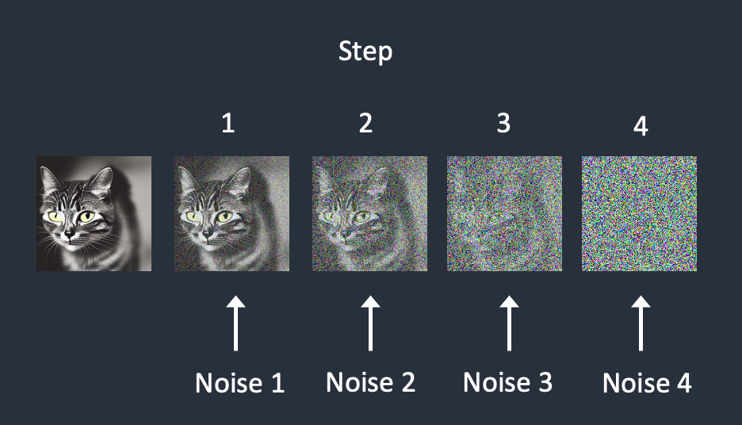

#  What is Stable Diffusion?

In the simplest form, Stable Diffusion is a text-to-image model. Give it a text prompt. It will return an AI image matching the text.

 
<figure>
  
  <figcaption style="color:grey; font-style: italic;">Credit: Andrew Wong, 2023, "How does Stable Diffusion work?"</figcaption>
</figure>
 

## Diffusion model training

To understand how it works, we need to understand how it is trained. During the training phase, what we call the "forward diffusion" process adds noise to a training image, gradually turning it into an uncharacteristic noise image. The forward process will turn any cat or dog image into a noise image. Eventually, you won’t be able to tell whether they are initially a dog or a cat. At each step of the forward diffusion process, a noise predictor is trained to tell  how much noise was added - this will be useful to generate new images later on.

1. Pick a training image, like a photo of a cat.
2. Generate a random noise image.
3. Corrupt the training image by adding this noisy image up to a certain number of steps.
4. Teach the noise predictor to tell us how much noise was added.

 
<figure>
  
  <figcaption style="color:grey; font-style: italic;">Credit: Andrew Wong, 2023, "How does Stable Diffusion work?"</figcaption>
</figure>
 

After training, we have a noise predictor capable of estimating the noise added to an image.

## Reverse diffusion

What if we can reverse the diffusion? Like playing a video backward. Going backward in time. Starting from a noisy, meaningless image, reverse diffusion recovers a cat.

We first generate a completely random image and ask the noise predictor to tell us the noise. We then subtract this estimated noise from the original image. Repeat this process a few times. You will get an image of a cat.

 
<figure>
  
  <figcaption style="color:grey; font-style: italic;">Credit: Andrew Wong, 2023, "How does Stable Diffusion work?"</figcaption>
</figure>
 

For now, image generation is unconditioned. We will see how to apply conditioning to have control over the image generated.

## Differences between diffusion models and latent diffusion models

The above diffusion process is in image space. It is computationally very, very slow because the image space is enormous. For instance, a 512×512 image with three color channels (red, green, and blue) is a 786,432-dimensional space. Diffusion models like Google’s Imagen and Open AI’s DALL-E are in pixel space. They have used some tricks to make the model faster but still not enough.

Stable Diffusion, on the other hand, is a latent diffusion model which is designed to solve the speed problem. Instead of operating in the high-dimensional image space, it first compresses the image into the latent space. The latent space is 48 times smaller so it reaps the benefit of crunching a lot fewer numbers. That’s why it’s a lot faster.

## Variational Autoencoder

It is done using a technique called the Variational Autoencoder (VAE). The VAE neural network has two parts: an encoder and a decoder. The encoder compresses an image to a lower dimensional representation in the latent space. The decoder restores the image from the latent space.

 
<figure>
  
  <figcaption style="color:grey; font-style: italic;">Credit: Andrew Wong, 2023, "How does Stable Diffusion work?"</figcaption>
</figure>
 

The latent space of Stable Diffusion model is 4x64x64, 48 times smaller than the image pixel space. All the forward and reverse diffusions we talked about are actually done in the latent space.

The VAE decoder is also responsible for recovering fine details that may have been lost by the encoder. By further fine-tuning the VAE decoder, the model can paint finer details.

## Reverse diffusion in latent space

Here’s how latent reverse diffusion in Stable Diffusion works.

1. A random latent space matrix is generated.
2. The noise predictor estimates the noise of the latent matrix.
3. The estimated noise is then subtracted from the latent matrix.
4. Steps 2 and 3 are repeated up to specific sampling steps.
5. The decoder of VAE converts the latent matrix to the final image.

Our understanding is incomplete: Where does the text prompt enter the picture? Without it, Stable Diffusion is not a text-to-image model. You will either get an image of a cat or a dog without any way to control it. This is where conditioning comes in.

## References

- [Andrew Wong, 2023, "How does Stable Diffusion work?", _Stable Diffusion Art_](https://stable-diffusion-art.com/how-stable-diffusion-work/)
- [Guodong (Troy) Zhao, 2023, "How Stable Diffusion works, explained for non-technical people", _Medium_](https://bootcamp.uxdesign.cc/how-stable-diffusion-works-explained-for-non-technical-people-be6aa674fa1d)
