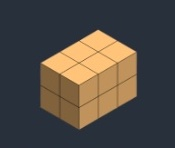

## Text to Image

In text-to-image, you give Stable Diffusion a text prompt, and it returns an image.

**Step 1.** Stable Diffusion generates a random matrix in the latent space.  This is your image in latent space. But it is all noise for now.

 
<figure>
  
  <figcaption style="color:grey; font-style: italic;">Credit: Andrew Wong, 2023, "How does Stable Diffusion work?"</figcaption>
</figure>
 

**Step 2.** The noise predictor takes the latent noise image and the text prompt as inputs and predicts the noise, also in latent space  matrix.

 
<figure>
  
  <figcaption style="color:grey; font-style: italic;">Credit: Andrew Wong, 2023, "How does Stable Diffusion work?"</figcaption>
</figure>
 

**Step 3.** Subtract the latent noise from the latent image. This becomes your new latent image.

 
<figure>
  
  <figcaption style="color:grey; font-style: italic;">Credit: Andrew Wong, 2023, "How does Stable Diffusion work?"</figcaption>
</figure>
 

**Steps 2 and 3** are repeated for a certain number of sampling steps, for example, 20 times.

**Step 4.** Finally, the decoder of VAE converts the latent image back to pixel space. This is the image you get after running Stable Diffusion.

 
<figure>
  
  <figcaption style="color:grey; font-style: italic;">Credit: Andrew Wong, 2023, "How does Stable Diffusion work?"</figcaption>
</figure>
 

## References

- [Andrew Wong, 2023, "How does Stable Diffusion work?", _Stable Diffusion Art_](https://stable-diffusion-art.com/how-stable-diffusion-work/)
