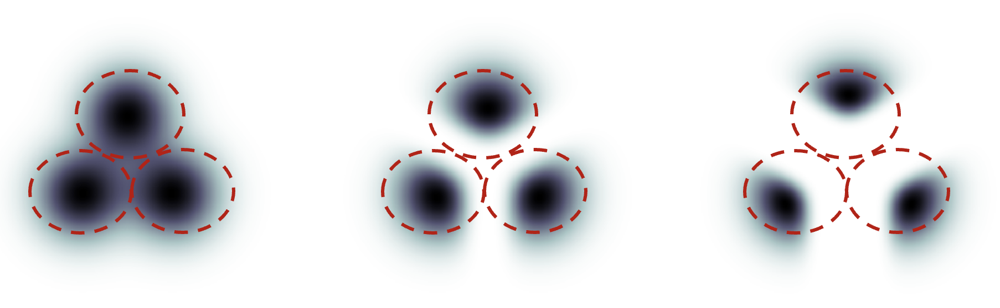

# What is the CFG value?

## Classifier guidance

Classifier guidance is a way to incorporate image labels in diffusion models. You can use a label to guide the diffusion process. For example, the label “cat” steers the reverse diffusion process to generate photos of cats.

The classifier guidance scale is a parameter for controlling how closely should the diffusion process follow the label.

Below is an example. Suppose there are 3 groups of images with labels “cat”, “dog”, and “human”. If the diffusion is unguided, the model will draw samples from each group’s total population, but sometimes it may draw images that could fit two labels, e.g. a boy petting a dog.

 
<figure>
  
  <figcaption style="color:grey; font-style: italic;">Credit: Jonathan Ho, Tim Salimans, 2022, "Classifier-Free Diffusion Guidance"</figcaption>
  <figcaption>Left: unguided. Middle: small guidance scale. Right: large guidance scale.</figcaption>
</figure>
 

With high classifier guidance, the images produced by the diffusion model would be biased toward the extreme or unambiguous examples. If you ask the model for a cat, it will return an image that is unambiguously a cat and nothing else.

The classifier guidance scale controls how closely the guidance is followed. In the figure above, the sampling on the right has a higher classifier guidance scale than the one in the middle. In practice, this scale value is simply the multiplier to the drift term toward the data with that label.

## Classifier-free guidance

Although classifier guidance achieved record-breaking performance, it needs an extra model to provide that guidance. This has presented some difficulties in training.

Classifier-free guidance, is a way to achieve “classifier guidance without a classifier” (i.e. without a separate image classifier). The text prompt provides this guidance in text-to-image.

## Classifier-free guidance scale

Classifier-free guidance scale (CFG scale) is a value that controls how much the text prompt steers the diffusion process. The AI image generation is unconditioned (i.e. the prompt is ignored) when the CFG scale is set to 0. A higher CFG scale steers the diffusion towards the prompt.

## Recommendations

Different CFG scale values:
- 1 – Mostly ignore your prompt.
- 3 – Be more creative.
- 7 – A good balance between following the prompt and freedom.
- 15 – Adhere more to prompt.
- 30 – Strictly follow the prompt.

7.5 is usually a good starting point.

## References

- [Andrew Wong, 2023, "Know these Important Parameters for stunning AI images", _Stable Diffusion Art_](https://stable-diffusion-art.com/know-these-important-parameters-for-stunning-ai-images/#CFG_Scale)
- [Andrew Wong, 2023, "How does Stable Diffusion work?", _Stable Diffusion Art_](https://stable-diffusion-art.com/how-stable-diffusion-work/)
- [Jonathan Ho, Tim Salimans, 2022, "Classifier-Free Diffusion Guidance"](https://arxiv.org/abs/2207.12598)
