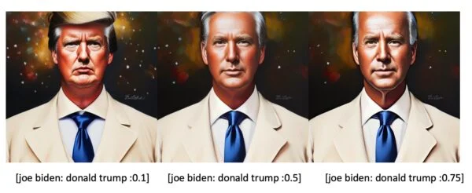

# Prompt engineering

The prompts you input guide the AI to generate the images you desire. Think of it like having a conversation with an artist: the clearer and more detailed your request, the closer their work will be to your vision.

## Understanding language associations with images

The AI that you're interacting with is like an art student who has studied countless pieces of artwork. It has been trained on a vast amount of visual and linguistic data, learning to link words with related images. For instance, when the AI hears "sunset," it understands to use warm colors, soft transitions, and the silhouette of the sun descending.

The AI interprets prompts based on the associations it has learned. However, it's important to remember that AI, unlike humans, doesn't truly understand the meaning behind the words. Instead, it leverages patterns found in its training data to produce a relevant response.

## Simple steps to crafting prompts

To create the most accurate images, you need to provide the AI with detailed prompts. Just like an artist, the AI benefits from clear instructions about your desired image.

### Be descriptive and specific

This could be easily the most difficult part – we find ourselves sometimes struggling with the fact that we have this image in our heads and not enough or accurate words to describe it. Therefore, the AI will give us an image maybe close enough to our idea but not entirely. Use adjectives to be more accurate in your description. Also, keep in mind order matters – words near the front of your prompt are weighted more heavily than the things in the back of your prompt.

### Prompt anatomy

Follow this structure to craft your prompt:

- Medium
 Is it a photograph, drawing, oil painting, pencil sketch, 3D render...?

- Subject
 Define the subject, subject attributes (hair, clothing, jewellery, facial expression), scene (environment, camera angle, overall mood). The more descriptive you are with the use of adjectives, the better the output.

- Artistic attributes

  - Style
   What is the artistic movement or style? (e.g., realistic, comic book, impressionist, abstract)
  - Artist or popular references ("in the style of" e.g. Van Gogh, Akira)

  - Quality Modifier
    - Website (e.g., featured in artstation, award-winning)
    - Resolution (e.g., 4K)
    - Render or film type (e.g. Octane, polaroid)
    - Lighting (e.g., dramatic lighting, bokeh, dappled light)
    - Colors
    - Any additional details

 
An example of a detailed prompt might be:

> Impressionist oil painting of a tranquil forest in South of France on a coast line, soft sea waves foam smashing on the rocks at sunset with vibrant colors and soft, golden dappled light filtering through the trees.

### Prompts are model-dependent

Different models have been trained on different datasets and may interpret prompts in slightly varying ways. Therefore, what works well for one model might not work as well for another.

## Negative Prompts

A negative prompt, also known as an unconditioning prompt, is used to express terms, elements, or conditions that are undesired or should be avoided in the final output. In the realm of visual arts, this could include characteristics that you don't want to see in the image such as certain colors, themes, styles, or subjects. These prompts provide explicit guidance on what not to include in the creation process. They can affect the subject displayed, composition and style.

## Keyword Weigth

InvokeAI and AUTOMATIC1111 both support this feature but not all applications may support it. Also, the syntax below is for InvokeAI but it may be different from one application to another.

### Upweight (+)

The positive modifier (+) can be used in a prompt to increase the focus or attention on a specific term. By adding '+' next to a term, you're signaling the importance of this aspect in the response, encouraging more emphasis on it.

Example:
>landscape painting, trees++

This prompt would encourage a focus on trees in the landscape painting.

Alternatively, you can include the specific amount you'd like to upweight a term as a number following parenthesis, such as:
>landscape painting, (trees)1.2

Each + multiplies the weight of that term by 1.1

### Downweight (-)

The negative modifier (-) can be used in a prompt to decrease the attention or focus on a specific term. By adding '-' next to a term, you're suggesting less emphasis on this aspect in the response.

Example:
>urban photography, people-

This prompt would introduce the concept of "people" into the composition, but encourage less significant focus on them.

Alternatively, you can include the specific amount you'd like to downweight a term as a number following parenthesis, such as:
>urban photography, (people)0.8

Each - multiplies the weight of that term by 0.9.

## Blends

InvokeAI and AUTOMATIC1111 both support this feature but not all applications may support it. Also, the syntax below is for InvokeAI but it may be different from one application to another.

The blend feature is used to merge the meaning of two or more prompts together, in order to modify the model's understanding of what you are asking for. This is not the same as adding prompts together. Instead, this feature is best used to blend in stylistic components.

Example:
> ("landscape painting, trees++", "sunset scene, warm tones++").blend(1,1)

This would result in a landscape painting focused on trees and a sunset scene with warm tones, giving equal importance to both prompts.

 

By using names of actors and actresses, it is easy to generate good-looking faces. But the downside is the faces are too recognizable. You can also use to blend the faces of famous people together in order to generate a unique yet consistent face.

Example:
> ("joe biden", "donald trump").blend(1,1)

 
<figure>
  
  <figcaption style="color:grey; font-style: italic;">Credit: Andrew Wong, 2022, "Fine tune your images with simple prompting techniques", Stable Diffusion Art</figcaption>
  <figcaption>The syntax used here is for AUTOMATIC1111</figcaption>
</figure>
 

This would result in a blend of the two faces together to form a new one.

## Reverse prompting, prompt generators & boilerplates

## CLIP for reverse prompting

CLIP (Contrastive Language-Image Pretraining), is a model developed by OpenAI that predicts the most relevant text snippet given an image. It can be used to reverse-engineer the prompt of an image and use it for inspiration to generate similar images.

## Prompt generators & boilerplates

Some websites offer users the possibility to share their AI-generated images along with the prompts and parameters. This can be a good resource for you to get inspired, use existing prompts as boilerplates to remix them and craft better prompts. See the list of resources for more details.

## Resources

[Useful links & tutorials for Prompt engineering](../../resources/prompt_engineering.md)

## References

- [Tips on Crafting Prompts](https://support.invoke.ai/support/solutions/articles/151000096606-tips-on-crafting-prompts), InvokeAI, 2023
- [Advanced Prompting Syntax](https://support.invoke.ai/support/solutions/articles/151000096723-advanced-prompting-syntax), InvokeAI, 2023
- [How to come up with good-prompts](https://stable-diffusion-art.com/how-to-come-up-with-good-prompts-for-ai-image-generation/), Andrew Wong, 2023, _Stable Diffusion Art_
- [Fine tune your images with simple prompting techniques](https://stable-diffusion-art.com/fine-tune-your-ai-images-with-these-simple-prompting-techniques/), Andrew Wong, 2022, _Stable Diffusion Art_
- [The Ultimate Prompting Guide](https://prompthero.com/stable-diffusion-prompt-guide), PromptHero and anntartica, _PromptHero_
