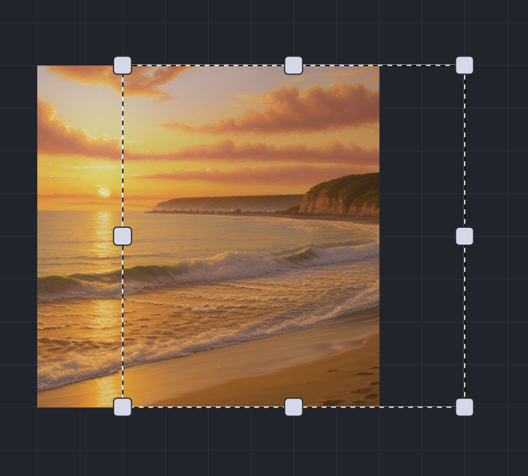

# Outpainting

Outpainting is a process where we try to extend the content of an image beyond its original boundaries. It's like an artist taking a small painting and extending the scene onto a larger canvas.

Imagine you have a picture of a beautiful beach but the picture only shows a small part of it. With outpainting you could expand the image to see more of the beach, the ocean, the horizon.

## Outpainting in InvokeAI

On Invokes unified canvas, you can outpaint by expanding the bounding box and extending the box to capture an area that you would like to have generated. If you invoke with the bounding box covering an area that has no image data, the missing will be outpainted on Invoking.

**Step 1.** Import image in the unified canvas and expand the bounding box.

 
<figure>
  
</figure>
 

**Step 2.** Use a prompt to extend the image

 
<figure>
  
</figure>
 

## Workflow

Generally, it’s advisable to only outpaint with about ~25% of the image missing in the area currently selected by the bounding box, and to keep the bounding box to no more than ~768x768 in size - This is because the models are typically trained on smaller images, and need sufficient examples of what are already in the image to generate something useful outside of it.

It is also recommended to use the same model for outpainting that you used to generate the base image, as it would help keep the style consistent.

Repeat the process to mask any resulting seams between the new and base image to ensure that the generation fits in well.

## Tutorials & resources

[Useful links & tutorials for Inpainting and Outpainting](../../resources/inpainting_outpainting.md)

## References

- [InvokeAI, 2023, "What are Inpainting and Outpainting? ", _Invoke Support Portal_](https://support.invoke.ai/support/solutions/articles/151000096702-what-are-inpainting-and-outpainting-)
