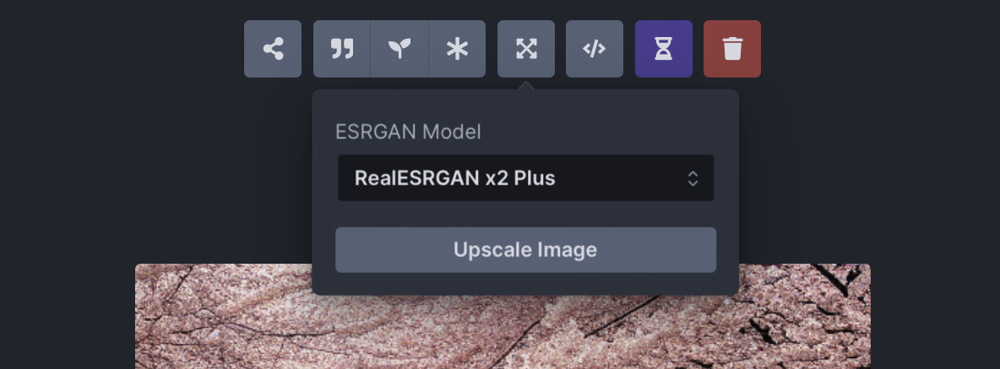

# Upscaling

The default image size of Stable Diffusion v1 is 512×512 pixels. This is pretty low in today’s standard. Also, a complex scene generated by Stable Diffusion is often not as sharp as it should be. It often struggles with fine details. An AI Image upscaler is an indispensable tool to improve the quality of images generated by Stable Diffusion. In fact, it is so commonly used that many Stable Diffusion GUIs has built-in support for it.

The Real-ESRGAN (R-ESRGAN) upscaler is a good choice for photographs or realistic paintings. Anime images require upscalers specifically trained for recovering animes.

## Workflow

Usually the worksflow goes like this:
- use text-to-image to generate an image in the model’s default resolution (for SDv1.5: 512×512)
- inpaint some areas to fix some details
- upscale to the desired resolution
- use inpaint again to recover details

## Upscaling in InvokeAI

Open the upscaling dialog by clicking on the "expand" icon located above the image display area in the Web UI:

 
<figure>
  
  <figcaption style="color:grey; font-style: italic;">Credit: InvokeAI, 2023, "Postprocessing", Github</figcaption>
</figure>
 

The default upscaling option is Real-ESRGAN x2 Plus, which will scale your image by a factor of two. This means upscaling a 512x512 image will result in a new 1024x1024 image. Other options are the x4 upscalers, which will scale your image by a factor of 4.

## Tutorials & resources

[Useful links & tutorials for Models](../../resources/models.md). Includes download links of Upscalers.

## References

- [Andrew Wong, 2023, "How to use AI image upscaler to improve details", _Stable Diffusion Art_](https://stable-diffusion-art.com/ai-upscaler/)
- [InvokeAI, 2023, "Postprocessing", _Github_](https://github.com/invoke-ai/InvokeAI/blob/main/docs/features/POSTPROCESS.md)
