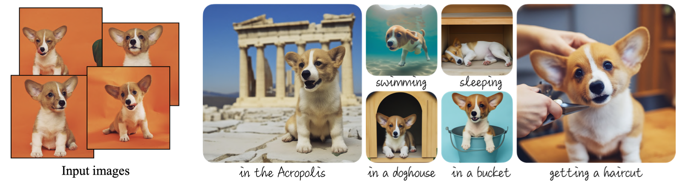

# Dreambooth

With DreamBooth, you’re training an entirely new version of Stable Diffusion, so in practice that’s going to be a model checkpoint. In the Stable Diffusion context, a checkpoint is basically an entirely self-sufficient version of a model; and that means it’s going to take up a bunch of space (usually 2GB+).

 
<figure>
  
  <figcaption style="color:grey; font-style: italic;">Credit:  Nataniel Ruiz, Yuanzhen Li, Varun Jampani, Yael Pritch, Michael Rubinstein, Kfir Aberman</figcaption>
</figure>
 

## How to use it

Dreambooth creates a new checkpoint model, similair to our base models (SDv1.5, SDXL). This means we can use them as standalone models.

## References

- [The beginner's guide to fine-tuning Stable Diffusion](https://octoml.ai/blog/the-beginners-guide-to-fine-tuning-stable-diffusion/), 2023, Justin Gage
- [DreamBooth: Fine Tuning Text-to-Image Diffusion Models for Subject-Driven Generation](https://arxiv.org/abs/2208.12242), 2022, Nataniel Ruiz, Yuanzhen Li, Varun Jampani, Yael Pritch, Michael Rubinstein, Kfir Aberman
