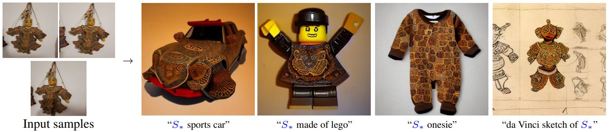

# Embedding (result of [Textual Inversion](https://textual-inversion.github.io/))

## Introduction

Dreambooth can yield pretty powerful results, but they come at a cost: size. Downloading an entire checkpoint for every model variation is going to eat up your hard drive fast, requires custom training, and takes a while. Textual Inversion, on the other hand, is pretty fast and easy.

Embedding defines new keywords to describe a new concept without changing the model. The embedding vectors are stored in files which size is very small, usually less than 100 kB.

From the Textual Inversion team:

> How can we use language-guided models to turn our cat into a painting, or imagine a new product based on our favorite toy?
> Using only 3-5 images of a user-provided concept, like an object or a style, we learn to represent it through new "words" in the embedding space of a frozen text-to-image model. These "words" can be composed into natural language sentences, guiding personalized creation in an intuitive way. Notably, we find evidence that a single word embedding is sufficient for capturing unique and varied concepts.

 
<figure>
  
  <figcaption style="color:grey; font-style: italic;">Credit:  Rinon Gal, Yuval Alaluf, Yuval Atzmon, Or Patashnik, Amit H. Bermano, Gal Chechik, Daniel Cohen-Or, Tel Aviv University, NVIDIA</figcaption>
</figure>
 

## How does it work?

In the text-encoding stage of most text-to-image models, the first stage involves converting the prompt into a numerical representation. This is typically done by converting the words into tokens, each equivalent to an entry in the model's dictionary. These entries are then converted into an "embedding" - a continuous vector representation for the specific token. These embeddings are usually learned as part of the training process. In our work, we find new embeddings that represent specific, user-provided visual concepts. These embeddings are then linked to new pseudo-words, which can be incorporated into new sentences like any other word. In a sense, we are performing inversion into the text-embedding space of the frozen model. We're calling the process 'Textual Inversion'.

## Use cases

Textual inversion can be used to reprensent a specific style, a character/person, some scenery, a fighting pose or reducing bias.

 
<figure>
  
  <figcaption style="color:grey; font-style: italic;">Credit:  Rinon Gal, Yuval Alaluf, Yuval Atzmon, Or Patashnik, Amit H. Bermano, Gal Chechik, Daniel Cohen-Or, Tel Aviv University, NVIDIA</figcaption>
</figure>
 

 
<figure>
  
  <figcaption style="color:grey; font-style: italic;">Credit:  Rinon Gal, Yuval Alaluf, Yuval Atzmon, Or Patashnik, Amit H. Bermano, Gal Chechik, Daniel Cohen-Or, Tel Aviv University, NVIDIA</figcaption>
</figure>
 

 
<figure>
  
  <figcaption style="color:grey; font-style: italic;">Credit:  Rinon Gal, Yuval Alaluf, Yuval Atzmon, Or Patashnik, Amit H. Bermano, Gal Chechik, Daniel Cohen-Or, Tel Aviv University, NVIDIA</figcaption>
</figure>
 

## Reducing biais

Text-to-image models suffer from biases inherited from the training data. Rather than learning a new concept, we can find new embeddings for 'biased' concepts. These are found using small datasets, so we can easily curate the data and ensure a fairer representation. For example, here we replace the model's notion of 'Doctor', with a new, more inclusive word.

 
<figure>
  
  <figcaption style="color:grey; font-style: italic;">Credit:  Rinon Gal, Yuval Alaluf, Yuval Atzmon, Or Patashnik, Amit H. Bermano, Gal Chechik, Daniel Cohen-Or, Tel Aviv University, NVIDIA</figcaption>
</figure>
 

## How to use it

To use this Textual Inversion, you first need to download the embedding. Note that it’s incredibly small (4KB). You'll need to use a “trigger word” in the prompt in order to associate with the embedding.

## References

- [The beginner's guide to fine-tuning Stable Diffusion](https://octoml.ai/blog/the-beginners-guide-to-fine-tuning-stable-diffusion/), 2023, Justin Gage
- [Andrew Wong, 2023, "Models", _Stable Diffusion Art_](https://stable-diffusion-art.com/models/)
- [An Image is Worth One Word: Personalizing Text-to-Image Generation using Textual Inversion](https://textual-inversion.github.io/), 2022, _arXiv_, Rinon Gal, Yuval Alaluf, Yuval Atzmon, Or Patashnik, Amit H. Bermano, Gal Chechik, Daniel Cohen-Or, Tel Aviv University, NVIDIA
