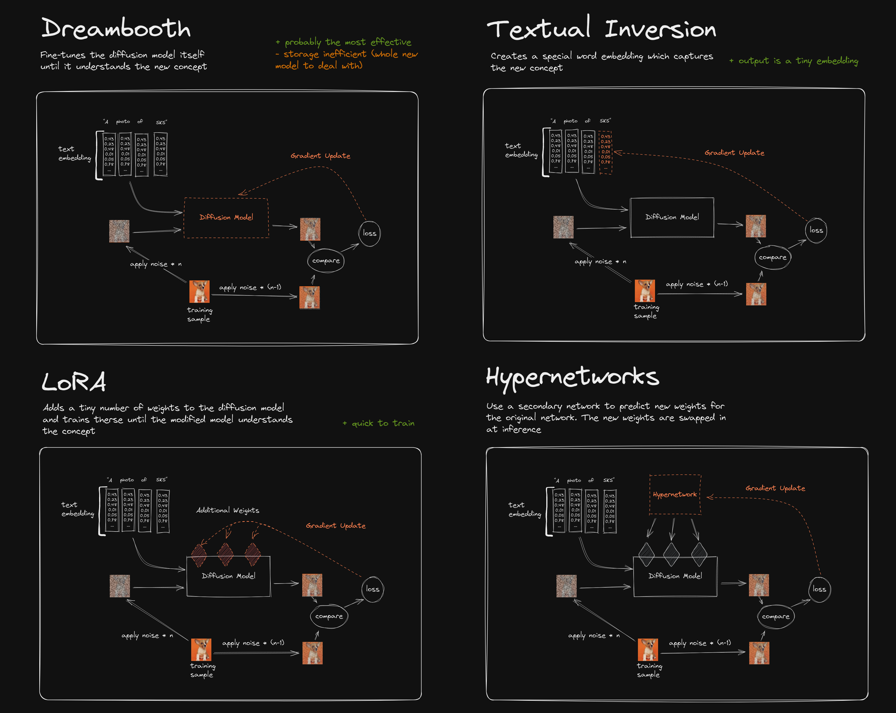

# Model training

## Introduction

Generative models like Stable Diffusion are trained on giant corpuses of text-image pairs, therefore generating novel subjects, concepts or environments requires a depth of expression that these models just don’t have. To quote the DreamBooth paper:

> While the synthesis capabilities of these models are unprecedented, they lack the ability to mimic the appearance of subjects in a given reference set, and synthesize novel renditions of the same subjects in different contexts. The main reason is that the expressiveness of their output domain is limited; even the most detailed textual description of an object may yield instances with different appearances. Furthermore, even models whose text embedding lies in a shared language-vision space cannot accurately reconstruct the appearance of given subjects but only create variations of the image content.

Model training allows us to "personalize" text-to-image diffusion models. Given as input just a few images of a subject, we can fine-tune a pretrained text-to-image model such that it learns to bind a unique identifier with that specific subject. Once the subject is embedded in the output domain of the model, the unique identifier can be used to synthesize novel photorealistic images of the subject contextualized in different scenes.

## Popular techniques

- Fine-tuning (Dreambooth, Hypernetworks)
- Embedding
- Improved VAE
- Merging models
- LoRA (Low-Rank Adaptation)
  - LyCORIS (Lora beYond Conventional methods, Other Rank adaptation Implementations for Stable diffusion)
  - LoHa (LoRA with Hadamard Product representation)
  - LoCon (Conventional LoRA)

 
<figure>
  
  <figcaption style="color:grey; font-style: italic;">Credit: use_excalidraw on reddit</figcaption>
</figure>
 

## Tutorials & resources

[Useful links & tutorials for Models](../../resources/model_training.md)

## References

- [The beginner's guide to fine-tuning Stable Diffusion](https://octoml.ai/blog/the-beginners-guide-to-fine-tuning-stable-diffusion/), 2023, Justin Gage
- [Andrew Wong, 2023, "Models", _Stable Diffusion Art_](https://stable-diffusion-art.com/models/)
- [DreamBooth: Fine Tuning Text-to-Image Diffusion Models for Subject-Driven Generation](https://arxiv.org/abs/2208.12242), 2022, Nataniel Ruiz, Yuanzhen Li, Varun Jampani, Yael Pritch, Michael Rubinstein, Kfir Aberman
- [Well-Researched Comparison of Training Techniques (Lora, Inversion, Dreambooth, Hypernetworks)](https://www.reddit.com/r/StableDiffusion/comments/10cgxrx/wellresearched_comparison_of_training_techniques/), 2022, use_excalidraw, _reddit_
